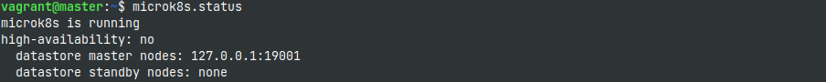
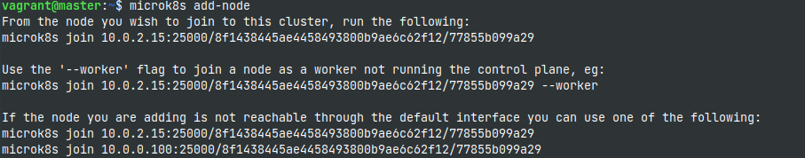
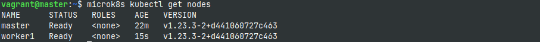
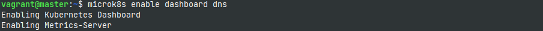
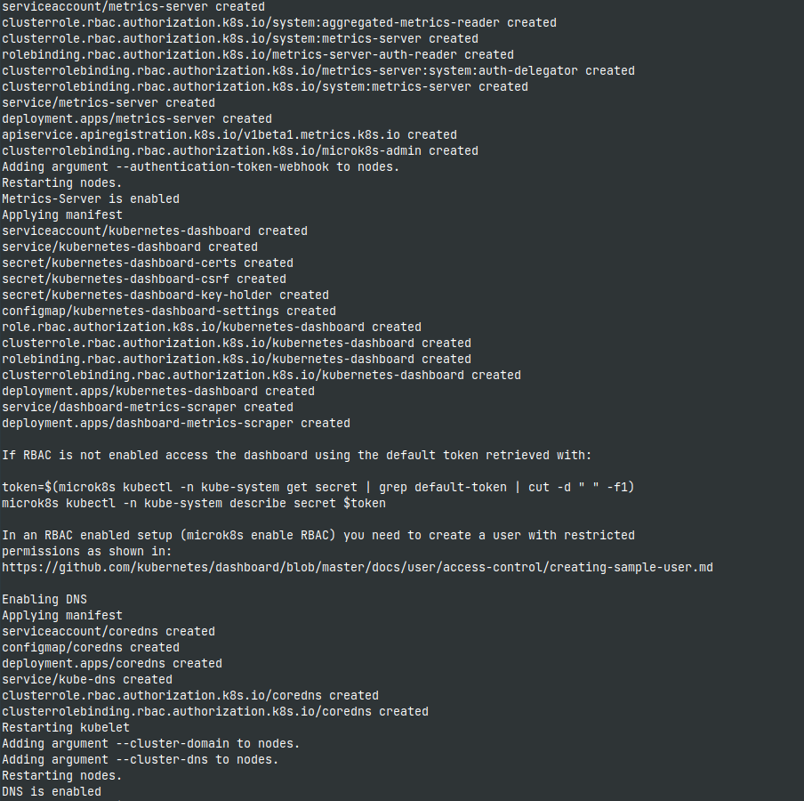
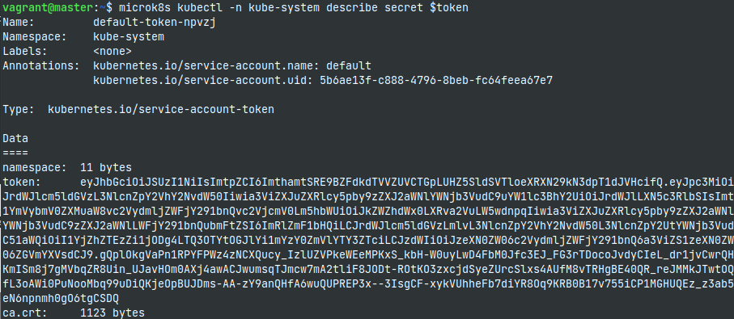
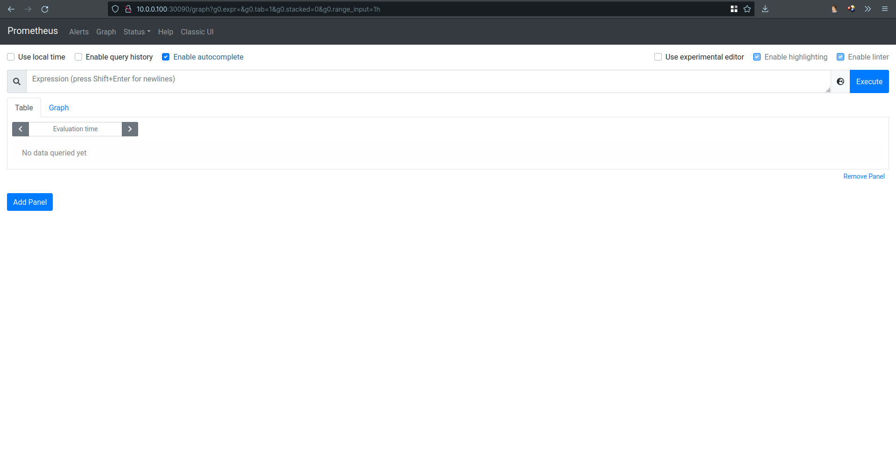
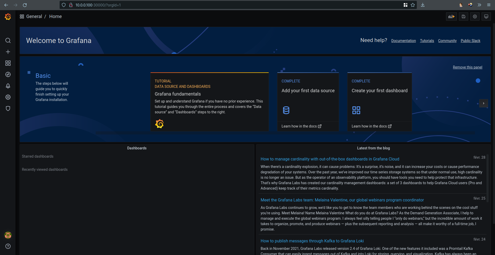

# EFREI_ST2VAS_Project
A vagrant script to build a pair of Ubuntu based VMs (master and worker) with MicroK8s and Docker installed in order to experiment with Kubernetes

### Check status



### Add worker node



### Check nodes from master


### Enable dashboard and dns



### Get the access token for the k8s dashboard



# Prometheus
Prometheus is enabled during the installation of the K8s cluster.
Then this manifests is applied to expose the solution.
```yaml
apiVersion: v1
kind: Service
metadata:
  name: prometheus-np
  namespace: monitoring
spec:
  ports:
  - nodePort: 30090
    port: 9090
    protocol: TCP
    targetPort: 9090
  selector:
    app.kubernetes.io/component: prometheus
    app.kubernetes.io/name: prometheus
    app.kubernetes.io/part-of: kube-prometheus
  type: NodePort
```


# Grafana
Grafana is enabled during the installation of the K8s cluster.
Then this manifests is applied to expose the solution.
```yaml
apiVersion: v1
kind: Service
metadata:
  name: prometheus-np
  namespace: monitoring
spec:
  ports:
  - nodePort: 30090
    port: 9090
    protocol: TCP
    targetPort: 9090
  selector:
    app.kubernetes.io/component: prometheus
    app.kubernetes.io/name: prometheus
    app.kubernetes.io/part-of: kube-prometheus
  type: NodePort
```
