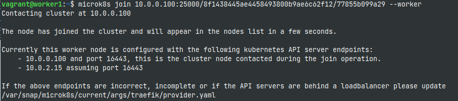

# EFREI_ST2VAS_Project
A vagrant script to build a pair of Ubuntu based VMs (master and worker) with MicroK8s and Docker installed in order to experiment with Kubernetes

### Check status

### Add worker node

### Check nodes from master

### Enable dashboard and dns

### Get the access token for the k8s dashboard

